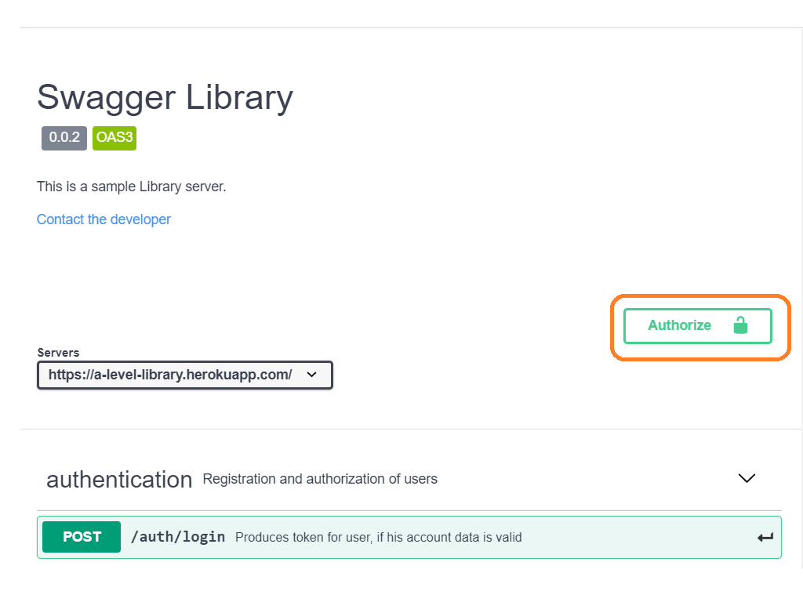

# README 

To have a look and test my API click on Swagger icon.
Also the app could say hello on start page. Testing of that could be done by clicking Heroku icon.
Both of actions could take some time while app will wake up after standby.

 
 

##API testing

For logging in as Admin use next credentials:

`{
 "login": "SuperDetective",
 "password": "elementaryWatson!"
 }`
 
###Tiny guide how to use Swagger OpenApi
 
- Let's have a look how to authorize in the app. First of all choose Post method with endpoint "/auth/login":
 
 
 
- Then click "Try it out" button:
 
 
 
- The third step is to copy the credentials above into the field that become active and press "Execute" button:

 
 
- Perhaps waiting of the response will take some time. After getting response copy to clipboard token (value of "token" field in response"):
 
 
  
 - Then press "Authorize" button on the top of the page:
  
  
    
 - The last step is to paste token in authorization field and clicking "Authorize" button  :
  
  
  
 - Well done, you are logged in!